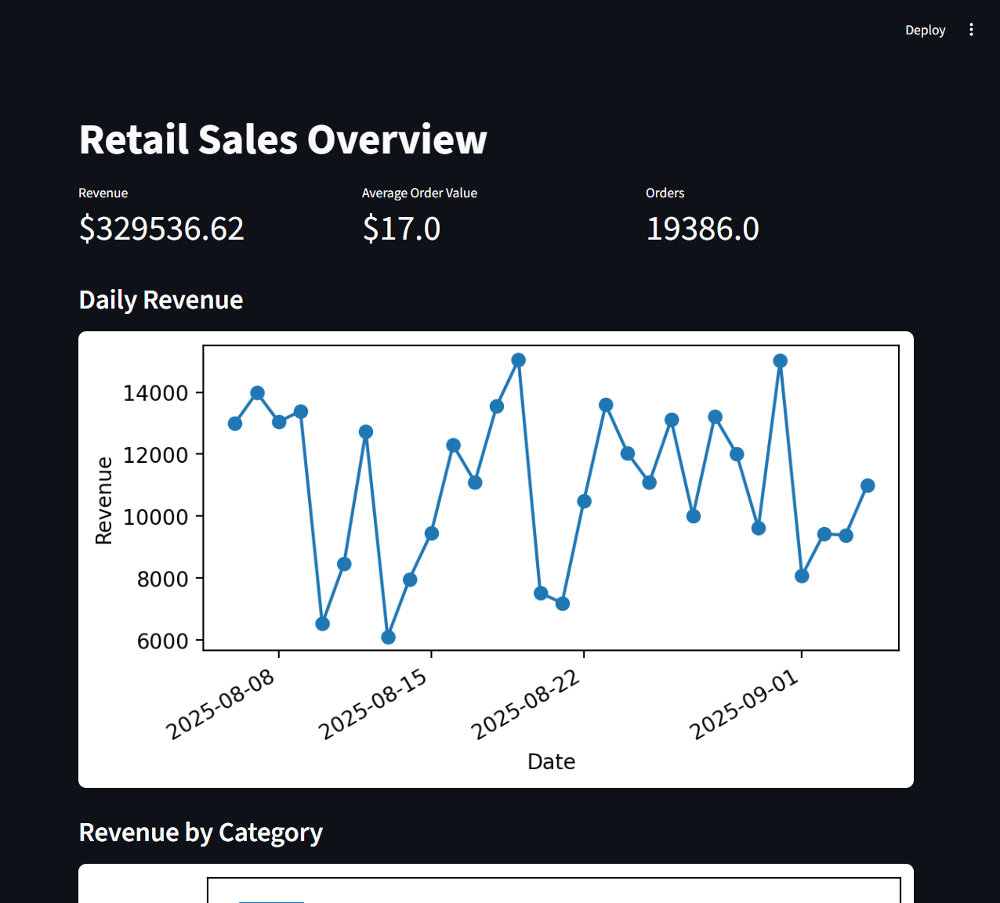

# 🛒 Retail Data Platform

This project is a demo **data platform architecture** built to simulate a retail environment.  
It demonstrates ingestion, storage, transformation, and analytics using modern data engineering tools.

## Features

- **Ingestion**: Synthetic retail datasets generated with Python & Faker.
- **Storage**: Loaded into **Postgres** via Docker.
- **Transformations**: **dbt** models for staging, marts, and data quality tests.
- **Orchestration**: **Apache Airflow** DAG to run daily (generate → load → dbt run/test).
- **Visualization**: **Streamlit** dashboard for KPIs, trends, and category revenue.
- **CI/CD**: GitHub Actions workflow runs `dbt parse` + Python linting on every push.
- **Docs**: Architecture diagram, dbt lineage, screenshots.

---

## 🏗️ Architecture

<!-- add screenshot: docs/architecture.png -->
<p align="center">
  
</p>

## ⚡ Quickstart

### 1. Clone & setup

```bash
git clone https://github.com/your-username/retail-data-platform.git
cd retail-data-platform
cp .env.example .env
```

## 2. Bring up Postgres + Adminer

```bash
docker compose up -d
```

## 3. Run pipeline end-to-end

```bash
run_add.bat
```

This runs:

Generate CSV data

Load into Postgres

dbt run + dbt test

## 4. Launch dashboard

```bash
streamlit run dashboard/app.py --server.address=0.0.0.0 --server.port=8501

```

## 📊 Screenshots

### Dashboard

<p align="center">  </p>

### Airflow DAG

<p align="center">  </p>

### dbt Lineage

<p align="center">  </p>

## 🧪 Data Quality (dbt tests)

not_null → IDs and foreign keys

unique → primary keys

relationships → fact → dimension integrity

accepted_values → region, category

freshness → order_date recency

## 📦 Tech Stack

Python 3.12

Postgres 14

dbt-postgres

Apache Airflow 2.9

Streamlit

Docker / docker-compose

GitHub Actions

## 🚀 Why This Project?

This project is designed to showcase end-to-end Data Engineering skills:

Building reproducible pipelines

Containerization & orchestration

Data modeling with dbt

Monitoring + testing

Serving data to analysts & dashboards

CI/CD for data

## 👤 Author

### Ricky

💼 Aspiring Data Engineer \| Web Developer → Data Platforms  
📧 kengeangkang@gmail.com  
🔗 [LinkedIn](https://www.linkedin.com/in/kengeang-kang/)
